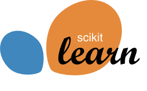

# Awesome scikit-learn 

> Machine Learning in Python

## Contents

- [Applications](#applications)
- [Books](#books)
- [Documentation](#documentation)
- [Frameworks](#frameworks)
- [Papers](#papers)

## Applications

- [dash-svm](https://github.com/plotly/dash-svm) - Interactive exploration of Support Vector Machine (SVM).

## Books

- [scikit-learn Cookbook (2nd edition, 2017)](https://www.packtpub.com/big-data-and-business-intelligence/scikit-learn-cookbook-second-edition) - [Companion code](https://github.com/PacktPublishing/scikit-learn-Cookbook-Second-Edition).
- [Learning scikit-learn: Machine Learning in Python (2013)](https://www.packtpub.com/big-data-and-business-intelligence/learning-scikit-learn-machine-learning-python)
- [Building Machine Learning Systems with Python](https://www.packtpub.com/eu/big-data-and-business-intelligence/building-machine-learning-systems-python-third-edition) - [Companion code](https://github.com/luispedro/BuildingMachineLearningSystemsWithPython).
- [Statistics, Data Mining, and Machine Learning in Astronomy: A Practical Python Guide for the Analysis of Survey Data](https://press.princeton.edu/titles/10159.html)

## Documentation

- [Quick Start Tutorial](http://scikit-learn.org/stable/tutorial/basic/tutorial.html)
- [User Guide](http://scikit-learn.org/stable/user_guide.html)
- [API Reference](http://scikit-learn.org/stable/modules/classes.html)
- [Example Gallery](http://scikit-learn.org/stable/auto_examples/index.html)

## Frameworks

### Frameworks built on top of scikit-learn 

- [ML-ENS](http://ml-ensemble.com/) - High performance ensemble learning: ML-ENS combines a Scikit-learn high-level API with a low-level computational graph framework to build memory efficient, maximally parallelized ensemble networks in as few lines of codes as possible.
- [modAL](https://modal-python.readthedocs.io/en/latest/) - A modular active learning framework.
- [nilearn](http://nilearn.github.io/) - Machine learning for Neuro-Imaging.
- [tslearn](https://tslearn.readthedocs.io/en/latest/) - Machine learning tools for the analysis of time series.
- [Reproducible Experiment Platform (REP)](http://yandex.github.io/rep/)
- [SciKit-Learn Laboratory (SKLL)](https://skll.readthedocs.io/en/latest/)

### Frameworks scikit-learn is built on top of

- [SciPy](https://www.scipy.org/) - Ecosystem for mathematics, science, and engineering.
  - [Matplotlib](https://matplotlib.org/) - Comprehensive 2D Plotting.
  - [numpy](https://numpy.org/) - Base N-dimensional array package.
  - [pandas](https://pandas.pydata.org/) - Data structures & analysis.

## Papers

- [Scikit-learn: Machine Learning in Python (2011)](http://jmlr.org/papers/v12/pedregosa11a.html)
- [API design for machine learning software: experiences from the scikit-learn project](https://arxiv.org/abs/1309.0238)
